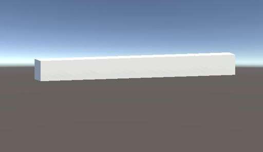
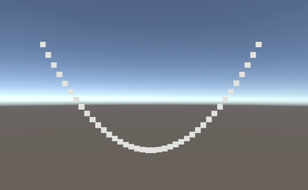
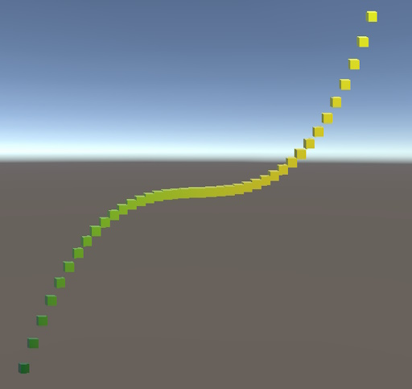

# Building a Graph in Unity

This Unity project uses game objects to build a graph so that mathematical formulas are showcased based on the tutorial [Building a Graph](https://catlikecoding.com/unity/tutorials/basics/building-a-graph/) by [Jasper Flick](https://catlikecoding.com/).

## Overview

The purpose of this project is to provide a practical example of using Unity game objects to create a graph representation and demonstrate mathematical formulas. By following the tutorial by Jasper Flick, you can understand the fundamentals of building a graph in Unity.

## Tutorial Source

- Tutorial: [Building a Graph](https://catlikecoding.com/unity/tutorials/basics/building-a-graph/)

- Author: [Jasper Flick](https://catlikecoding.com/)

## Progress Checklist

- [x] **Creating a Line of Cubes:** Start by creating a simple line of cubes to represent the graph.

    

- [x] **Creating More Cubes:** Expand the graph by adding more cubes, enhancing its complexity.

    

    
</p

- [ ] **Animating the Graph:** Bring the graph to life with animations, making it dynamic and engaging.

## License

This project is licensed under the MIT License - see the LICENSE file for details.

## Acknowledgments

[Jasper Flick](https://catlikecoding.com/) for the excellent Unity tutorial.

